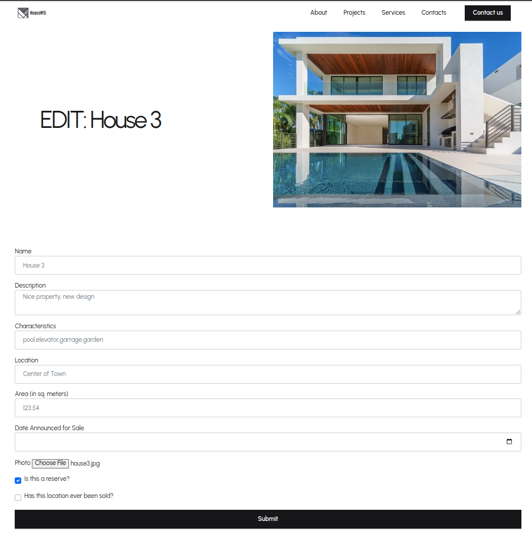

# Exam Task 
## Repair shop

You are tasked with creating a real estate agency management system. The system should intuitively display properties for sale, provide information about the agents responsible for selling them, and allow easy searching of properties based on their features. Each property that can be listed for sale is characterized by a name, a description of its location, the area it occupies, the date it was listed for sale, a photo, information on whether it has been reserved, and whether it might already be sold.

The agents responsible for sales within the agency are characterized by their first and last name, contact phone number, a link to their LinkedIn profile, the number of completed sales to date, and an email address. An agent can be responsible for multiple properties, and a property can be offered by multiple agents. Agents responsible for a particular property can be easily added in the Admin panel in the property section. The property does not have an initial price; instead, its price is calculated as the sum of the values of the features it possesses. For example, if the property has an elevator, $10,000 is added to the price; having a pool adds $25,000, etc. (the prices are determined by you when creating the features). Features for a property can also be added in the property section.

The application will include a homepage and a page for modifying/editing property sale listings. Additionally, some customization of the Django admin panel is required.

### Admin Panel Functionalities

- Agents and Features can only be added by superusers.

- Agents, Features, and Properties are displayed by their names (including last name, area, and description where applicable).

- Sale listings can only be added by agents, and the agent who adds the listing is automatically assigned as one of the responsible agents for that property.

- A listing can only be deleted if no features have been added to describe it.

- Listings can only be modified by agents responsible for selling them, while other agents can only view those listings.

- Superusers in the Admin panel see only the listings published on the current date.

### Signals
- When a listing/property is marked as sold, all agents associated with it should increment their sales count.

### Web Application Functionality
The web application consists of a single homepage, as shown in the image below, displaying all properties that are not sold and have an area greater than 100 square meters.

---
### `index.html`

---
There is also a page for editing information about a given property. This page opens when the "Edit" button is clicked. On this page, the features of a property are displayed, separated by commas. If new features are added or some of the existing ones are removed, the price should automatically update (features cannot be added or removed through the form, only via the admin panel). The design of the page is shown below.

### `edit.html`

