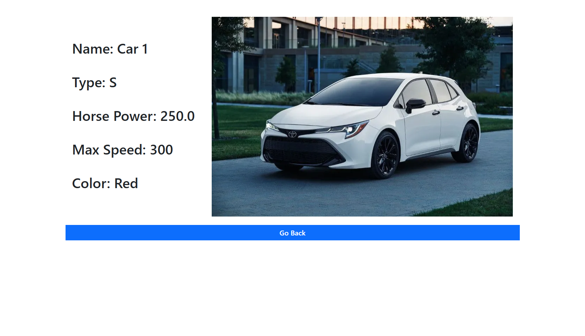
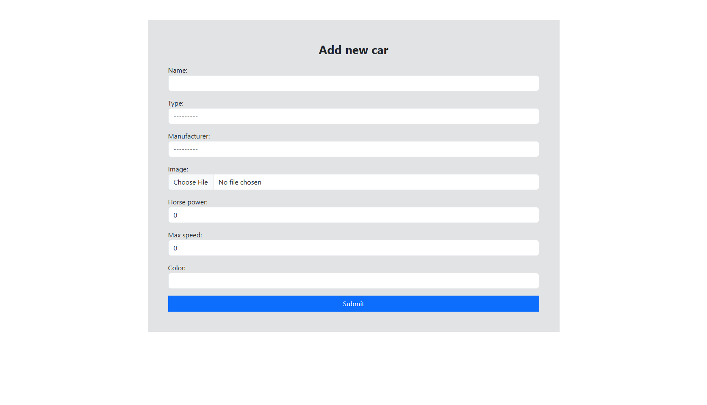

# Lab exercise 4

## Django Forms, Views & Urls 

You are tasked with creating a car management system that allows users to add and manage cars from different manufacturers. The system should display detailed information about each car, including its name, type, manufacturer, image, horsepower, maximum speed, and color. Each car added to the system is associated with a specific user who adds it. The type of a car can be one of several predefined categories, such as Sedan, Hatchback, Coupe, or Liftback.

The manufacturers responsible for producing the cars are described by their name, the name of the company owner, and the country where the manufacturer is based. A manufacturer can be linked to multiple cars, while each car can have only one manufacturer. Users can view only the manufacturers that produce cars they own, ensuring that each user’s manufacturer list is personalized and relevant to their added cars.

The system will include a homepage, a page for viewing detailed information about a specific car, and a page where users can add new cars to the system. Additionally, several customizations must be made to the Django admin panel to meet the required functionality.

### Admin Panel Functionalities

- Cars are displayed in the admin panel by their name and type.

- When a new car is added, the logged-in user is automatically assigned as its owner.

- Only the user who added the car or a superuser can delete it, preventing unauthorized deletions.

- The admin panel includes filtering options by car type, allowing easier navigation and management of vehicles.

- Manufacturers can only be added or deleted by superusers, as they represent shared data across all users.

- Manufacturers are displayed by their name and owner in the admin panel.

- Regular users can only view manufacturers linked to the cars they own, ensuring access is restricted to relevant data.

---

### `index.html`

---

### `details.html`

---

### `add.html`
